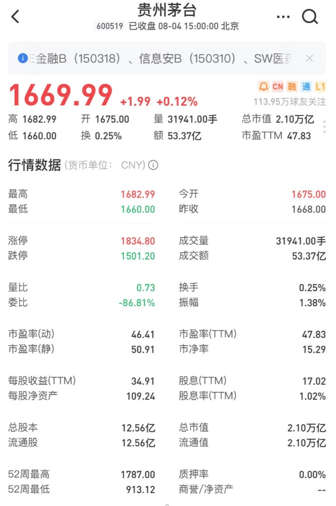

# 股票名词说明

以贵州茅台为例，通过雪球炒股软件讲解。

## 基本字段

### 总市值

**公式**：总市值 = 总股本 * 最新价
**含义**：指一家上市公司的总股份按市场价格计算出来的股票总价值。

茅台总市值(2.10万亿) = 总股本(12.56亿) * 最新价(1669.99)

### 流通值

**公式**：流通值 = 流通股本 * 最新价
**含义**：指一家上市公司再该市场流通的股份按市场价格计算出来的股票价值。

茅台流通值(2.10万亿) = 流通股本(12.56亿) * 最新价(1669.99)

### 总股本

**含义**：总股本是股份公司发行的全部股份总数。
**港股中**，多地上市公司，总股本包括在多地上市的全部股份；
**A股中**，未全部流通股份的公司，总股本包括流通股、非流通股。

茅台总股本(12.56亿)

### 流通股

**含义**：流通股本指上市公司仅在该市场流通的股份。

茅台流通股(12.56亿)，全部为流通股。

### 换手率
**公式**：
换手率(A股) = (现成交量 / 流通股本) * 100%
换手率(港股、美股) = (现成交量 / 总股本) * 100%

**含义**：指在一定时间内市场中股票转手买卖的频率，是反映股票流通性强弱的指标之一。股票热度。

茅台换手率(0.25%)（需要和历史数据对比？）

一般情况，大多股票每日换手率在1%——2.5%（不包括初上市的股票）。70%的股票的换手率基本在3%以下，3%就成为一种分界。那么大于3%又意味着什么？当一支股票的换手率在3%——7%之间时，该股进入相对活跃状态。7%——10%之间时，则为强势股的出现，股价处于高度活跃当中。（广为市场关注）
10%——15%，大庄密切操作。超过15%换手率，持续多日的话，此股也许成为最大黑马。

世界各国主要证券市场的换手率各不相同，相差甚远，相比之下，中国股市的换手率位于各国前列。

### 振幅

**公式**：振幅 = (当日最高价 - 当日最低价) / 昨日收盘价 * 100%
**含义**：指股票开盘后的当日最高价和最低价之间的差的绝对值与前一日收盘价的百分比，它在一定程度上表现股票的活跃程度。

茅台振幅(1.38%) = (1682.99 - 1660.00) / 1668.00 * 100% （和历史对比？）

### 委比

**公式**：委比 = (委买手数 - 委卖手数) / (委买手数 + 委卖手数) * 100%
**含义**：指在报价系统之上的所有买卖单之比，用以衡量一段时间内买卖盘相对力量的强弱。

### 委差

**公式**：委差 = 委卖手数 - 委卖手数
**含义**：某品种当日委买和委卖的差额。

### 量比

**公式**：量比 = (现成交量 / 现累计开始时间(分)) / 过去5日平均每分钟成交量
**含有**：指股市开市后平均每分钟的成交量与过去5个交易日平均每分钟成交量之比，是衡量相对成交量的指标。

### 内盘、外盘

**含义**：外盘又称主动性买盘，即以卖盘价(大于等于卖一价)成交的累积成交量；内盘又称主动性卖盘，即以买盘价(小于等于买一价)成交的累积成交量。外盘反映主动买的意愿，内盘反映主动卖的价钱。

## 财务字段

### 市盈率(静)

**公式**：市盈率(静) = 总市值 / 最近一期年报的归属于母公司股东的净利润
**含义**：静态市盈率忽略了短时间的变化，使用最近一期年报财务数据计算，所以该指标滞后于企业即时的状态。

### 市盈率(TTM)

**公式**：市盈率(TTM) = 总市值 / 最近4个季度归属于母公司股东的净利润之和。
**含义**：市盈率(TTM)弥补了上市公司季节性利润差异所造成的影响，同时也弥补了静态市盈率时效滞后的缺点。

### 市盈率(动)

**公式**：市盈率(动) = 总市值/(最新季度归属于母公司股东的净利润 * 4)
**含义**：指总市值除以预估全年净利润的比值。其中预估全年全年净利润，使用最近一期财务数据计算，例如当前公布一季度净利润1000万，则预估全年净利润4000万。ß

一般来说，市盈率水平为：
- <0 ：指该公司盈利为负（因盈利为负，计算市盈率没有意义，所以一般软件显- 示为“—”）
- 0-13 ：即价值被低估
- 14-20：即正常水平
- 21-28：即价值被高估
- 28+ ：反映股市出现投机性泡沫

需要和整个行业横向对比，以及该股票历史市盈率纵向对比。

### 市净率

**公式**：
市净率(A股、美股) = 最新股价 / 最新期年报的每股净资产
市净率(港股) = 最新价 / 最新的每股净资产
**含义**：指股价与每股净资产的比值

熊市大家爱用市净率来选股

### 股息率

公式：股息率 = 股息 / 最新价
含义：指