# 中国最牛的基金经理有哪些？
最近股市一直过山车式震荡

今早开盘上涨指数又连飙几个V型，真是心惊肉跳...

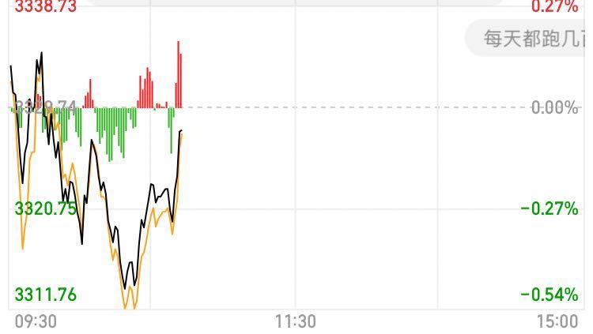

3300-3400总的来说，点位仍然较高，并不是股票基金买入的最好时机。

这个时间段，建议大家还是尽量持币观望。

赚钱的机会很多，既然没在车上，就不要高点杀入徒增烦恼。

**01**

**当然，未雨绸缪还是非常有必要的。**

今天主要讲讲如果未来有买入的机会，该买哪个基金，选哪个基金经理？

先简单说说为啥买基金

**其实就一点：不要用我们的爱好挑战别人的专业。**

上交所统计年鉴显示，2017年A股市场中的散户贡献了82%交易量，

盈利却不到当年投资盈利总额的一成。

而专业机构却用14.76%的交易量从市场中获取了32.3%的盈利。

这就是用业余挑战专业最直观的结果。

我多年实战下来，也发现自己瞎折腾半天，不如把钱交给比自己牛逼几倍的基金经理，省心、省力、在家睡觉就能躺赚。

**我现在基金持仓200多万，收益杠杠滴，我还不用瞎操心。**

基金经理为啥比我们一般人牛逼？

说一组最直观的数据，据统计，公募基金现任的2521名基金经理中，

全部毕业于综合类或财经类大学top10的本科，清华、北大、复旦、交大占比最大。

在我们家那种小县城，能考上清北复交等名校，每年都难有一个，不仅要在县里摆上半个月的流水席，连名字都要写进县志里。

但即便名校硕士，也只是最低门槛，只有前20%才有资格进入投资研究行业。

即便进入投资研究行业，又只有20%最出类拔萃的研究员，可以进入基金经理选拔的预备队—基金助理团队。

十年如一日的深耕于投资领域，写过的研报，看过的数据以千万计，才有可能成为基金经理。

即便成为基金经理，大部分也比较平庸，又只有前20%的人能业绩出众，成为大众追捧的明星。

一个明星基金经理等于：

考上名校的人中龙凤 x 20%的概率成为研究员 x 20%的概率成为基金经理 x 20%的概率成为明星

百万里挑一！

**02**

在我看来，90%的散户把钱交给比自己牛逼10倍的明星基金经理，肯定比自己拍脑袋乱买好。

相当于请詹姆斯，库里，杜兰特、哈登等人帮我们打篮球，这不是虐哭大多数人嘛。

对于散户唯一的困难是怎么选出明星基金经理。

其实，这只是一层窗户纸，多多今天就来帮大家捅破这层窗户纸。

**挑选明星基金经理的标准非常简单。**

**就两个核心标准：**

**1、业绩牛逼**

**2、业绩持续牛逼**

**首先，业绩牛逼**

基金经理，业绩代表一切。

不能赚钱的基金经理哪怕研究做的再好都是白扯。

上知天文，下知地理，知识储备吊打博士生导师，没有业绩，白扯！

量化模型做的完美无缺，报告写的天花乱坠，扣人心弦，没有业绩，白扯！

每日加班到深夜，日日盯盘分析k线，熬到满头白发，没有业绩，白扯！

在投资市场衡量一个人是否优秀的唯一标准就是业绩。

巴菲特为何牛逼，因为他几十年的年化复合利率高达21%，业绩全球前几名。

如果他只是一个糟老头子，不会有人会看他的书，学习他的理念，听他在台上夸夸而谈。

正如同衡量一个运动员好坏的唯一标准就是比赛成绩，衡量一个基金经理的唯一标准就是业绩。

一般来说，长期年化收益能够达到15%以上的就是非常牛逼的基金经理。

据Wind数据，截至目前，我国公募基金共有1570位权益类基金经理。

通过筛选，一千多名基金经理中年化收益达到15%以上的只有108人。

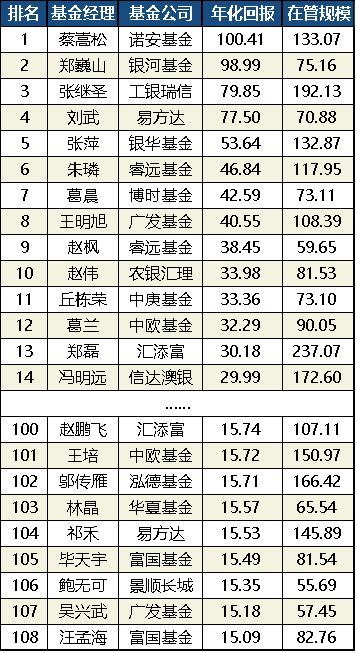

**其次，业绩持续牛逼**

牛掰一时可能是运气好，但一直牛掰就真的可以体现出一个人的绝对实力。

NBA的詹姆斯为什么能被称为联盟第一人，因为他在15年的职业生涯中一直维持着最顶尖的战绩。

把他任何一个赛季的成绩拎出来都是傲视群雄，偶尔还可以创造历史之最，刷爆全场。

基金经理一年两年赚钱可能有运气成分，

但如果一个人穿越牛熊，每一段时间的业绩单独拎出来都能跑赢市场，这就是绝对实力。

这说明他选股能力，入场时机，卖出时机，微观技术能力，心态等综合能力都非常牛，没有明显的短板，自己长板还是历史级的，某些方面还有让人绝望的天赋。

而且，一个人业绩一直牛逼，说明他经历过股市各种极端情况，久经考验的战士。在未来，他们大概率还会一如既往的创造优秀的业绩。

根据多多的筛选标准，一般5年是一个牛熊轮回，

所以要选投资经验5年以上，经历过牛熊历练的基金经理。

通过这一步的筛选，还剩下80位基金经理继续脱颖而出。

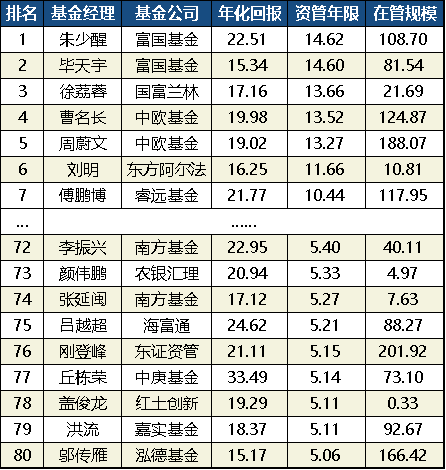

每个行业真正绝对出类拔萃真的就是那么一小撮人。

在这个市场上谁也不傻，基金公司会笼络最优秀的基金经理，开出最好的待遇让他们管最多的资本。

而投资者也会用脚投票，把钱交给最牛逼的基金经理投资。

我们只需要看看基金公司让哪些人管最多的钱，市场上的投资者最愿意把钱交给谁，

毕竟聪明的钱永远不会骗人。

我统计了全市场143家公募基金公司中，主动权益类基金前20名基金公司的管理规模，

TOP20的总规模为2.71万亿，占比已经达到70.91%。

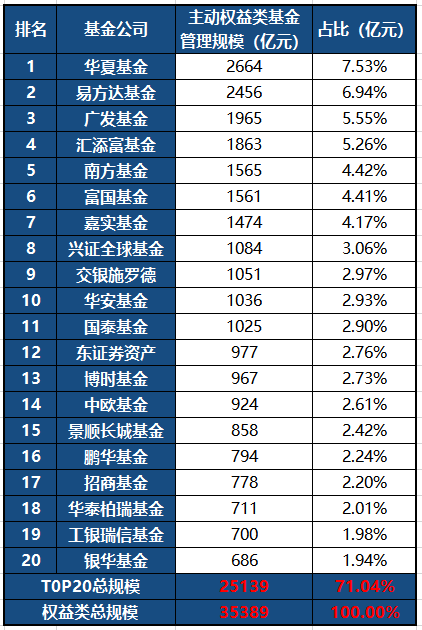

（数据来源：wind，截至2020.6.29，统计口径为wind基金分类中的股票型基金+混合型基金）

我们还统计了权益类基金经理的管理规模，结果同样令人惊讶不已：

**TOP20%的基金经理管理着整个权益市场80%的基金份额。**

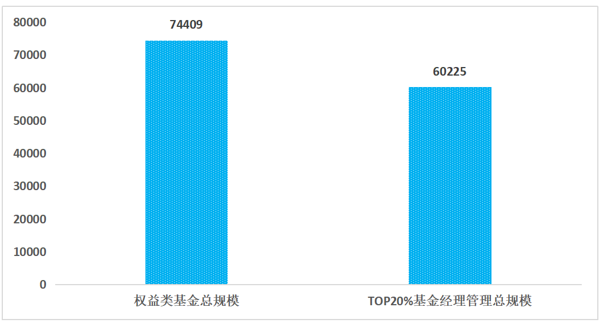

统计说明：据wind数据，A股权益类基金经理1570位，管理基金规模74409亿；TOP20%基金经理1570*20%=345位，管理基金规模60225亿，占比60225/74409=80.94%。

**二八规则也从侧面说明，真正绝对优秀的其实也就是那么一小撮的人。**

**持续5年年化收益15%以上的80强基金经理本身已经非常牛逼** 。

但我要做的是优中选优，找出真正被市场公认的最牛逼的30位基金经理。

在80强的基础上，我反复查看、调研了全网资深投资者，同行的各种评价，

研究了近百份访谈，参考了官方非官方的各种基金经理获奖情况等等，

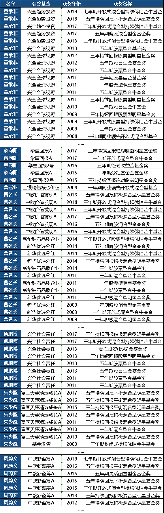

多多最后总结出了A股最赚钱梦之队30强基金经理供大家参考。

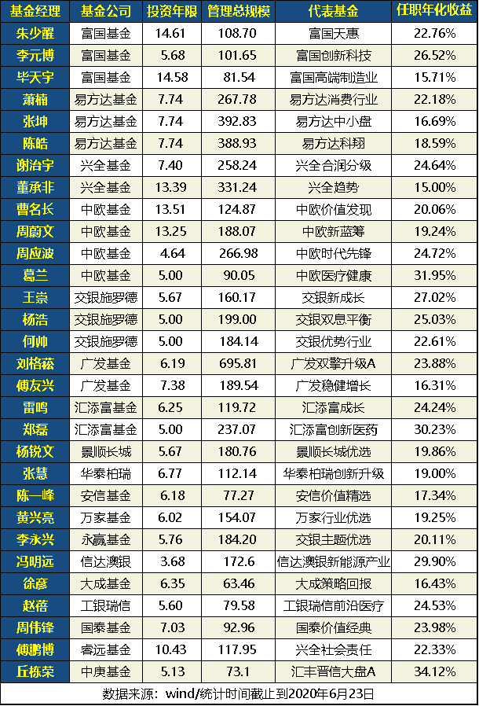

PS：名单里除了一些老将，我也兼顾选了近3-5年年化超过20%的成绩少壮派。

这份30强基金经理名单可能并没有囊括完A股公募基金最优秀的基金经理，

我只是尽量保守，选了一些市场普遍公认，确实非常优秀的基金经理供大家参考。

只要紧紧抓住这一小撮基金经理，长期拿3-5年，

我们大概率上就能赚到非常不错的收益。

**03**

在这些最顶尖的明星基金经理中，多多要着重介绍三位实力派老将和五位少壮派，

无一例外的是，他们都是市场上公认最牛掰的“神级”基金经理。

**实力老将**

**富国朱少醒**

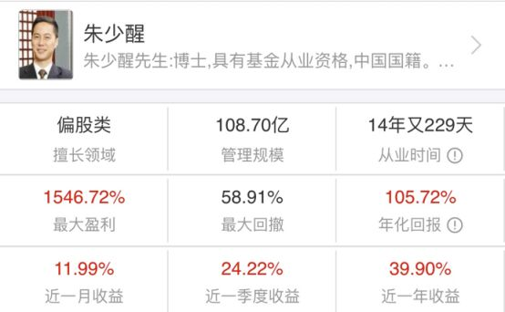

**点评：** 从业时间最久，长跑成绩最优秀，最专一的基金经理。

朱少醒朱帅，从业14年零229天时间，历经4轮牛熊，期间不乏2008，2015两次股灾。

累计收益1544.74%，年化复合收益率高达20.6%，要知道巴菲特大神也只做到了21%。

公募基金届最坚挺，最专一的基金经理，长期业绩优秀，不抱团，不惧回撤（喜欢死扛）。

唯一的问题或许就在于朱少帅是一位很喜欢重仓死扛的选手，

如果你的择时能力一般，很可能在买了他的基金后很长一段时间不赚钱甚至亏钱。

**广发刘格菘**

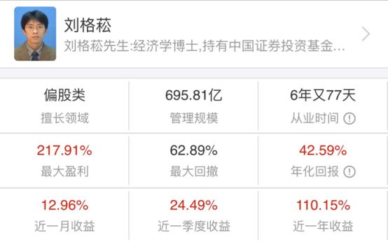

点评：激进的风格型选手，牛市表现亮眼，把握回撤的能力一般。

刘格菘老师，人称“牛市终极印钞机”。

常常在行业风格来临时实现翻倍。

他是目前中国公募历史上，直接掌管权益类基金规模最大的人，规模超过695亿元。

在a股市场在3000点上下颠簸，指数微微颤动的2019年，

刘老师旗下管理的几只基金收益率都超过100%，包揽年度公募基金排行榜前三。

他所管理的7只产品今年以来的表现也十分亮眼。

喜欢跟踪热点，热衷于局部翻倍行情的激进投资者，

或者想要在牛市获取超额收益的投资者，最适合选择他的基金。

**易方达张坤**

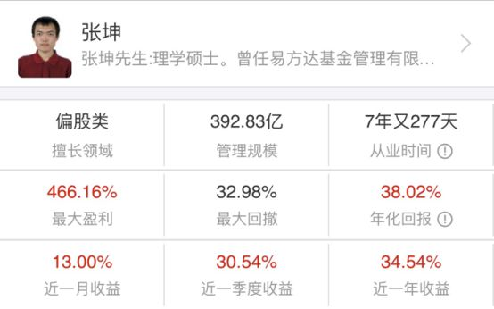

**点评：** 坚定持有中规中矩大白马，业绩稳健，持续超越指数

张坤张老师，国内最大公募基金公司易方达的头牌。

他的代表作易方达中小盘（110011），在2012年接手以来，

基金总回报高达430.83%，复合年化20.7%，在wind和晨星等基金评价网站上均是最高的5星评级。

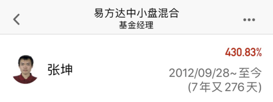

在他12年的生涯中，一直维持着最顶尖的状态，出道即是巅峰，一直巅峰到现在，未曾跌落神坛。

易方达中小盘今年一季度的前十大重仓股都是200亿以上的大市值公司，

截止一季度末，易方达中小盘已经：

连续持有茅台24个季度，五粮液21个季度，泸州老窖16个季度，

上海机场10个季度，苏泊尔10个季度，华兰生物6个季度，爱尔眼科6个季度。

全都是市场公认的大白马。

该基金的比较基准是沪深300，成长性却比沪深300要好很多，

未来不出意外的话仍然会稳如磐石，适合稳健投资者选择。

少壮派基金经理

**周应波、冯明远** ：

TOP30强榜单中，仅有的两位管理年限在5年以下的基金经理。

他们是基金经理中少壮派的代表，相比前面那些有多年业绩的“老司机”，这两位“年轻一代”的业绩也毫不逊色。

周应波管理中欧时代先锋以来，获得了24.72%的年化回报。

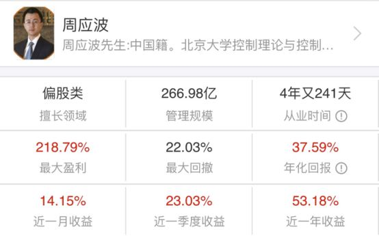

冯明远管理信达澳银新能源产业以来也获得了29.90%的高额年化回报，都非常地出色。

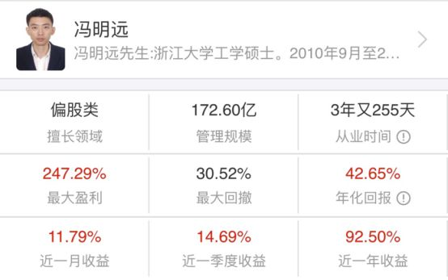

**交银三剑客--王崇、何帅、杨浩**

交银这么些年给公募市场培养出不少优质的基金经理，除了李永兴外，

王崇、何帅、杨浩也是目前交银培养出的公募基金经理中的佼佼者，

俗称交银“三剑客”，长期年化收益均在20%以上，非常地厉害。

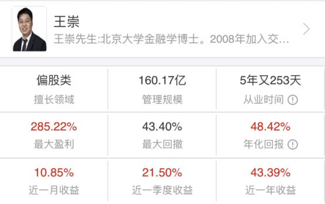

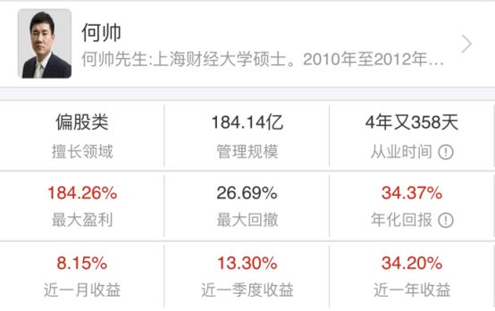

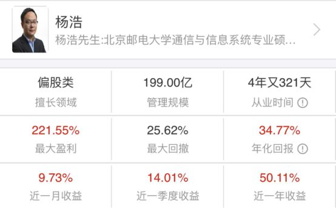

篇幅有限，就不展开介绍了。

如果大家感兴趣，后面我开个专题挨个讲一讲这些股神的传奇。

跟着中国顶尖股神混，死死抱住大腿，咱们10年1000万定会逐步实现。

**基金实际上非常简单，99%的人投基金亏损的主要原因是不懂，看完下面这些攻略，将帮你远离亏损，赚10%-15%收益。**

## **基金全攻略：**

[1、基金全攻略：基金盈利47万的老司机，手把手教你基金如何赚钱](https://link.zhihu.com/?target=https%3A//mp.weixin.qq.com/s/_vl2xGTAYrYkgFMI7y80iQ)

[2、基金如何选：帮大家彻底搞懂怎么选出优质基金](https://link.zhihu.com/?target=https%3A//mp.weixin.qq.com/s/Xru39ieAMJb5q--W0NCmfw)

[3、基金怎么买：90%的人不懂，基金买入时机极其重要，这篇文章帮你彻底搞懂](https://link.zhihu.com/?target=https%3A//mp.weixin.qq.com/s/LaIpw8PUd2s1m82RTJukug)

[4、基金怎么卖：手把手教你基金怎么卖，才能赚100%收益。](https://link.zhihu.com/?target=https%3A//mp.weixin.qq.com/s/CuVE2jEHVs22VQjN1P2rSQ)

## 下面是 **重磅：**

[5、基金干货书籍：我给大家整理了10几本经典书籍，帮你功力会再上一个台阶](https://link.zhihu.com/?target=https%3A//mp.weixin.qq.com/s/qhIrGqku46EDimKZnSCi0A)

[6、基金20强名单：公认优秀的基金名单，业绩可以超过80%的基金](https://link.zhihu.com/?target=https%3A//mp.weixin.qq.com/s/bUmwl71EOBTFxH7g5U4UIQ)

我现在基金持仓200多万，盈利60多万，一路走来，我非常知道朋友们的迷茫。

以我的真实经验，大家不要到处问来问去，看一些碎片化的知识。相信我，耐心的花1个小时，认真学学上面几篇完整攻略，基金就能基本学懂。

基金实盘我会每周更新，实盘完全按攻略在操作，实盘能让理论全部落地。大家不妨跟着实盘实践一下。不下水，永远学不会游泳。经过一轮涨跌，你真正赚到钱，你就完完全全搞懂基金了。

这是最快最捷径的一条路，也我真金白银实战的经验。

知乎是非常好的学习平台，我在知乎6年，真心学到很多。我也会努力分享干货，让更多后来者受益。有什么不懂的，尽管问，我一定知无不言!

[中国最牛的基金经理有哪些？](https://zhuanlan.zhihu.com/p/200768194)