# 让财报说话

## 前言 量化企业的财富管理

作为财务工作者和股票资者，你至少应该了解以下几点：

- 企业的经营状况
- 投资时机
- 市场看法

这就好比我们中国人常说的地利(企业的经营状况)、天时(投资时机)和人和(市场看法)。

**财务管理**就是用数字对企业进行量化管理，把企业所有的经 济行为都量化成数字，用数字衡量企业运营的好坏。

## 第1章 让财务报表说话

有没有通用的指标可以用来辨别一家企业的好坏呢？我认为主要看三方面：**产品**、**效率**和**财力**。

第一，企业永远是以卖产品或服务为生的，如果没有产品或服务，企业就没有 生存发展的基础。**任何企业都是以卖产品或服务为生的。所以，产品（以下将服务也归类为企业的无形产品）是企业管理者必须关注的重中之重，没有好的产品，就没有好的企业。**

第二，好产品的确至关重要，但再好的 产品也要有好的企业运营，才能生存和发展。那么，什么才是好的企业运营，它的标志又是什么呢？**效率。好企业都有相似之处——高效率**。

第三，**企业之间，一样的产品、一样的管理效率，分出胜负靠的就是“财力”**，或者说企业调动和运用资金的能力。

企业管理归根结底就是要管好三件事情：**产品**、**效率**和**财力**。

企业的价值 = 产品 × 效率 × 财力。

企业有三份主要的财务报表：**资产负债表**、**利润表**和**现金流量表**。

**产品：看利润表**

看一款产品或者服务好不好，主要看两点：“好不好卖”和“赚不赚钱”。

好卖，表示销量好，客户喜欢，而赚钱是企业生存的关键。好卖 不赚钱，企业越卖越亏;赚钱不好卖，企业没销量也无法生存。企业在 关注产品时，要做到既“好卖”又“赚钱”。

**效率：看资产负债表**

用财务的语言来说，效率高也就是企业做事的速度快，比如生产周 期、销售周期、收款周期都要比别人短。

**财力：看现金流量表**

要把握一家企业的“财力”，不仅要看现金流量表这份监控企业现金 流状况的表格，同时也要结合资产负债表上的资产负债结构(财务杠杆)，用最优的方式充分利用企业的资本结构，以获得更高效的回报。

一家好公司必须具备五个方面的能力，其中包括与“**产品**”相关的“**发展能力**”和“**控制能力**”，与“**效率**”相关的“**营运能力**”，与“**财力**”相关的“**偿付能力**”，以及**综合涵盖所有方面**的“**盈利能力**”。一旦企业家掌 握了这五大能力，整个企业基本上就尽在他的掌握之中了。

作为企业的管理者，第一步，必须永远重视“产品”的发展能力，找 到“产品”发展和增长的基本动因与原动力，推动企业快速和稳步发展。 第二步，强化企业的控制能力，尤其是针对“产品”的控制能力。这里的 控制能力，不仅包括“产品”制造成本的控制，而且包括对“产品”销售和 管理预算的执行情况的控制;不仅要控制结果，还要控制过程，建立全 面预算管理体制，指导日常工作。第三步，把握企业的营运能力，从企 业内部的应收账款、存货和固定资产等内部资产运作入手，找出并突破资产运用“效率”的瓶颈，找到商业模式的基点和关键点，从而使企业运 作“效率”大幅度提升。第四步，重视企业的偿付能力，关注企业的“财 力”，监控资金的流动情况，避免资金链断裂，同时充分利用财务杠 杆，力求投资者价值最大化。第五步，必须整体把控企业的盈利能力， 通过对毛利率和净利率、周转率和财务杠杆的分析，制订企业的发展战 略，决胜未来。

## 第2章 初识财务报表

资产负债表就好比是人体的**骨骼**，利润表则好比是人体的**肌肉**，现金流量好比是人体内流动着的**血液**。

仅仅有肌肉(利润表)、骨骼(资产负债表)和血液(现金流量表)还不够，一个健康的人，肌肉与骨骼是靠肌腱(所有者权益变动表)来连接的。

## 第3章 资产负债表

资产负债表好比是一个多宝格，有左右两个部分，左边部分代表权 利，右边部分代表义务。左边的权利告诉你，你所拥有和控制的资产， 右边的多宝格代表负债和对股东的义务。

我们会按照资产的流动性，将资产分为**流动资产**和**长期资产**。也会按流动性将负债分为**流动负债**和**长期负债**。

流动是指负债的到期日，到期时限较短的，我们通常称为流动负 债，到期时限较长的则被定义为长期负债。通常以一年为限，大于一年的称为长期，反之则称为流动。

在企业实务管理中，我们往往会把资产和负债分得更细，以便日常 管理和控制。我们会把流动资产至少分成**货币资金**、**应收账款**以及**存货**，而将长期资产分为**固定资产**、**无形资产**和**长期投资**。 在负债方面，我们则会将流动负债区分为**短期借款**、**应付账款**、**应付职工薪酬**以及**应交税费**，将长期负债分为**长期借款**和**其他长期负债**。对于 所有者权益，我们通常也会分为三个部分:**股本**、**留存收益**和**资本公积**。

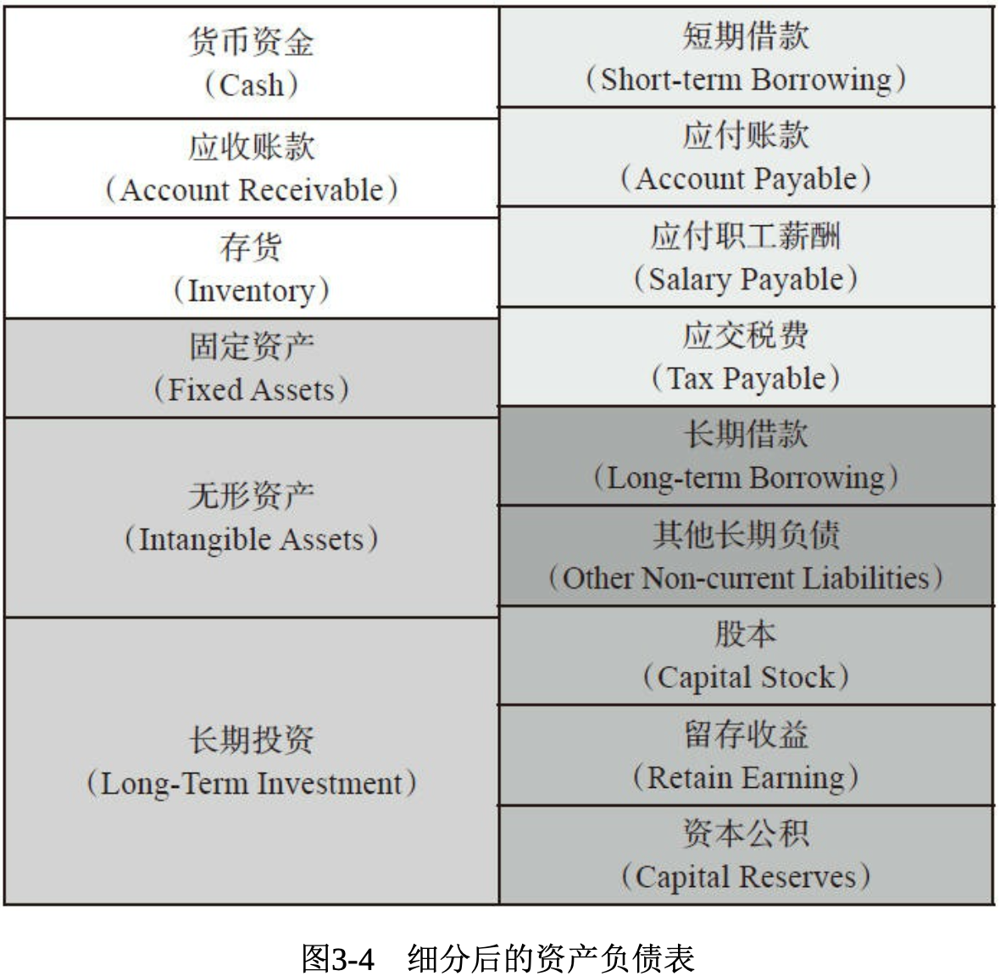

### 3.1 流动资产

**(1)货币资金**，顾名思义就是企业存放在银行的存款或者在自家 保险箱里的现金，是马上可以用的现钱，变现能力最强。

**(2)应收账款**，是企业在提供给客户产品或服务时，客户承诺付 款后，企业所得到的一个向客户收款的权利。

**(3)存货**，是指企业生产的产成品、半成品以及为生产所采购的 原材料和辅料。

企业的流动资产还会有更多的种类，如**应收票据**、**应收利息等**。其中**存货**和**应收账款**是企业最重要的两个管理指标。

### 3.2 长期资产

**(1)固定资产**。在企业中，用于生产的机器设备、用于运输的车 辆、用于办公的电脑设备以及用于生产或办公的厂房和办公楼都属于固定资产，固定资产就是企业自己拥有的用于生产或者办公的、价格相对较高、使用周期较长而且一般不以出售为目的的非货币资产。租来的资产，一般不算固定资产。

**(2)无形资产**。固定资产的特点是看得见摸得 着，而无形资产的特点则是看不见摸不着，比如最典型的无形资产就是软件系统。

**(3)长期投资**。与固定资产和无形资产完全不同，它是一种投 资，而且投资期限较长，一般超过1年。

### 3.3 流动负债

**(1)短期借款**。它是指必须在1年之内清偿的负债，比如1年内到期的银行贷款。

**(2)应付账款**。与短期借款不同，应付账款主要是针对供应商的欠款，而非银行欠款。

**(3)应付职工薪酬**。顾名思义，它是指应该付给员工的工资、奖 金以及福利等。

**(4)应交税费**。它是指欠税务局的税款。

以上是流动负债的主要构成部分，其他常见的流动负债还有**预付账款**等。

### 3.4 长期负债

**(1)长期借款**。与短期借款相对应，超过1年期的借款，统称为长期借款。

**(2)其他长期负债**。区别于银行的长期借款，通过其他途径获得 的需要偿还的借款，我们统称为其他长期负债。

### 3.5 所有者权益

所有者权益包含三大部分:**股本**、**留存收益**和**资本公积**。

**(1)股本**。它又称实收资本，是投资者实际投入的资本。

**(2)留存收益**。它也称为**未分配利润**，是每年企业赚的累计起来 没有被分配的利润。

**(3)资本公积**。它是指由企业股本溢价、接受捐赠以及法定财产 重估增值等原因所形成的所有权归属于股东的项目。

资产负债表是我所认识的所有财务报表中最重要的一份报表，是判断一家公司是否正常运营的基础，也是判断一家企业是否盈利的依据。

应付账款的资金 成本就是供应商的银行借款利息或者股权的股息加上他的利润率，所以**应付账款的资金成本一定会高于银行贷款利率**。

很多人又 会陷入一个误区:向股东募集资金的成本等于零。这个想法大错特错! 我们曾经做过一个调查，试图了解股票投资者的预期收益率是多少，调 查结果显示，多数股票投资者的预期收益率在10%左右，简单地说，就 是多数股票投资者投资上市公司期望得到的回报率约为10%。相应地， 可以推断企业投资者或者股东的预期回报至少超过同期银行贷款利率。由此可以得出一个结论，**企业向股东募集资金的成本一定会高于银行贷款利率**。

负债和所有者权益是企业的资金来源，而资金来源是有资金成本的，**通常情况下，可以预期的最低资金成本为银行的短期借款利息**。如果企业要盈利，其实就是如 何用募集来的资金去购买合适的资产，然后合理地运用和利用资产产生 回报(利润)，同时**左边资产的回报率要超过右边负债的资金成本，这样企业才能真正地“赚钱”**，这就是我为什么非常强调资产负债表的重要性。

应收账款和存货是这些数据的重中之重，是判断一家公司 是否正常运营的基础。

货币资金是自有的，而借款是外来的。通常情况下，自有的资金越 多越好，外来的借款越少越好。

银行借款也要看期限，关注其是长期的还是短期的。如果短期内到 期的短期借款金额太大，同时自有货币资金又远小于即将到期的借款金 额，就预示着公司近期在资金链上会有很大的麻烦。然而，如果长期积 累的借款逐年增多，而且数额过大，则表明公司是一台吞钱的机器，缺乏盈利和偿债能力。当然，借款和企业的发展息息相关，如果高速成长期已经过去，但银行借款额仍然过大，显然这家公司已经出现了问题，值得警惕。

固定资产和无形资产都是企业的长期资产，但两者也有很大的区 别，**固定资产代表了企业的硬实力，而无形资产则代表了企业的软实 力，特别是创新能力**。

应付账款是指在购买过程中欠供应商的钱。

资本公积是一个巨大的蓄水池，如果我们看到在一定时期内资本公积过大，显然这家公司就有操控利润的嫌疑。

未分配利润如果长时间积累，没有为广大股东分红，显然公司是一 只铁公鸡，这样的公司也是不受尊敬的。

## 第4章 利润表

世界500强企业是按照企业的销售收入来排名的。除了《财富》500强外，《福布斯》和《商业周刊》同样也有500强 的排名，它们的区别在于:《福布斯》综合考虑年销售额、利润、总资 产和市值;《商业周刊》只把市值作为主要依据。

同资产负债表一样，利润表也有一个恒等式:**收入 - 支出 = 净利润**

当收入大于支出时，企业才会有利润，如果收入小于支出，那么利润值就是负数，我们称之为亏损。利润表里最重要的项目是第一行的营 业收入，这是企业赖以生存的根源，也是企业利润的来源。营业收入一般分为主营业务收入和其他业务收入。

**(1)主营业务收入**，就是企业主要经营业务的收入。

**(2)其他业务收入**，是指除主营业务之外的其他业务带来的收 入。

支出在企业中往往被定义为两部分:一部分被称为成本，另一部分被称为费用。

**(1)成本**往往与收入是直接关联和对应的。成本是和生产产品直接相关的支出。

在实务操作过程中，我们将成本分为“**料”**“**工**”“**费**”，即原材料、人工费以及制造费用。

**(2)费用**与成本不同，**费用往往与收入没有直接的对应关系**。在企业经营中，与生产制造无关的支出，我们称之为费用。

按照性质和用途，我们又将费用分为三类:销售费用、管理费用、 财务费用。

**(1)销售费用**，只要和销售活动直接相关的支出，我们通常认为其就是销售费用。

**(2)管理费用**，管理和维系公司的营运而产生的费用。费用支出不会因为产品销售的变化而变化。

**(3)财务费用**，通常分为两类。一类，我们称之为**财务结算费用**，就像我们通过银行汇款时，银行收取的汇款**手续费**等各种服务费。另一类主要是**利息**，我们为了支持企业的经营发展，需要足够的资金，这些资金可以通过向银行贷款获得，但需要向银行支付利息，即使用这些资金的代价，我们也称这部分利息为财务费用。

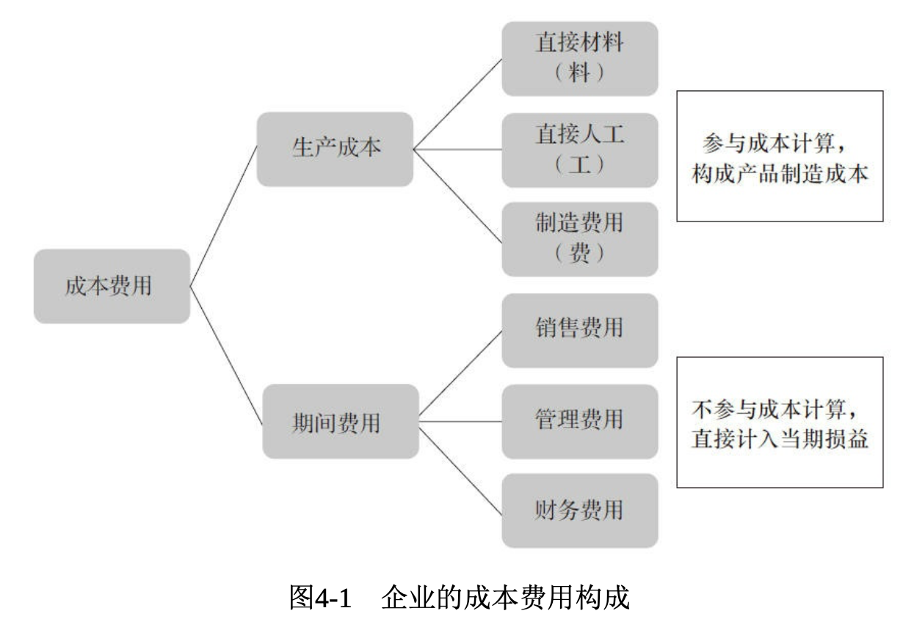

而利润表里往往暗藏着玄机，由于**权责发生制**的关系，收入和支出不一定要有真实的现金流动，只要发生了，便进行确认，因此有可能产生空有纸面利润而没有现金流入的情况。利润表最易操控，也最为可疑， 暴露的信息往往是不重要的东西。那么，如何发现利润的支撑点和利润 表中的盘根错节呢?

解读和分析利润表有三组关键项目，分别如下：
- 营业收入和营业成本。
- 毛利。 
- 三项费用(销售费用、管理费用和财务费用)。

只要把握这三组关键项目，就能抓住企业经营状况的核心，企业是 持续发展还是陷入困境，一目了然。

从投资者的角度出发，投资企业的第一步，就是要重点分析收入、 成本以及两者之间的逻辑对应关系。因为几乎所有的财务造假舞弊的公 司，都是为了做大营业收入，做小营业成本，尤其是主营业务。不少上市公司都是通过做大代理业务、做大流通、虚拟交易、一次性交易等做大营业收入的。

看毛利率，要紧紧追踪行业水平，比较历史水平，以及根据自身的 上下变动情况进行分析。

所谓三项费用就是指销售费用、管理费用和财务费用。在大多数情 况下，这三项费用是固定的。

除了以上三组关键项目以外，管理者和投资者还要重视企业的非经 常性损益。**所谓非经常性损益，就是与公司主营业务不直接相关的、偶然发生的一次性交易**。这个数据对于投资者来说尤为有价值。非经常性损益往往被上市公司用来当作救命稻草，一旦发现经营状况不景气，就通过变卖股权、出售资产、寻求政府补贴、税收返还等方式和途径，营造一个看上去漂亮，但充斥着泡沫的故事。

## 第5章 现金流量表

现金流量表，顾名思义，就是记录一家公司现金流入和流出的报 表，也就是我们中国历史上的“流水账”。

资产负债表关注企业的资产营运情况，利润表关注企业基于产品的收入和支出情况，而**现金流量表则重点关注企业资金链的安全性、流动性**。

现金流量表由三个部分组成，包括**经营活动产生的现金流量、投资 活动产生的现金流量以及筹资活动产生的现金流量。**

**经营活动产生的现金流量**，是指企业经营其主营业务而发生的现金 流出和流入，主要就是我们通常所说的产品和服务的业务活动，比较常 见的有收到的客户支付货款、为购买原材料向供应商支付的现金等。

一般来说，企业经营活动的现金流量除了要维持正常的生产经营以 外，还得有足够的现金流量来补偿经营性长期资产的折旧与摊销费用， 以及时更新生产所需设备，提高生产效率，还得保证有足够的现金以支 付到期债务和利息以及现金股利，并能为企业的发展提供现金流量的支 持。尤其是商品经营活动和提供劳务活动占较大比重的企业，**充裕的经营活动现金流量是企业正常运转的关键**。

- 销售商品、提供劳务收到的现金(流入)。
- 购买商品、接受劳务支付的现金(流出)。 
- 支付给职工以及为职工支付的现金(流出)。

**投资活动产生的现金流量**，是指企业进行投资活动所发生的现金流 出和流入，即将自己赚来的钱，投出去，再赚到钱。比较常见的有用现 金购买固定资产和设备，直接投资其他企业，购买股票、基金或债券等 支付的现金，等等。

投资活动的现金流量分为**对外投资现金流量**和**对内实体性资产投资现金流量**。

- 收回投资所收到的现金(流入)。 
- 取得投资收益所收到的现金(流入)。 
- 处置固定资产、无形资产和其他长期资产所收回的现金净额(流入)。
- 购建固定资产、无形资产和其他长期资产所支付的现金(流出)。

**筹资活动产生的现金流量**，是指企业在募集资金的过程中所发生的现金流入和流出，时尚地说，就是圈点钱回来。到哪里“圈”钱呢?无外 乎两个地方:一个是股票市场，另一个是债券市场。这也是资金的两个来源，第一种是以股本的形式，第二种是以负债的形式，何种形式取决于资金需求的多少及资金成本的大小。

**企业筹资活动产生的现金流量应该满足企业经营活动、投资活动的 需要，在整体上反映企业融资状况及其成效。**

如果企业筹资活动的净现金流量为正值，一般来说，企业的融资能 力较强，但应进一步关注资金的使用效果，特别是投资效果，一旦投资 失败，企业可能会在未来无法支付到期的债务本金和利息以及现金股利 而出现不能持续经营的危机;若该值为负，则可能表明企业的债务减轻，本身的盈利水平较高，且款项收回较快，但也可能是企业经营状况 恶化，声誉大跌，致使融资困难，这要结合利润表进行具体分析。以下 是筹资活动所产生的现金流量所包含的重要项目。

- 吸收投资所收到的现金(流入)。 
- 借款所收到的现金(流入)。 
- 收到的其他与筹资活动有关的现金(流入)。 
- 偿还债务所支付的现金(流出)。 
- 分配股利、利润或偿付利息所支付的现金(流出)。 
- 支付的其他与筹资活动有关的现金(流出)。

无论你是企业的管理者还是投资者，研究和分析现金流量表，**重中之重是掌握企业经营活动的现金流量**。

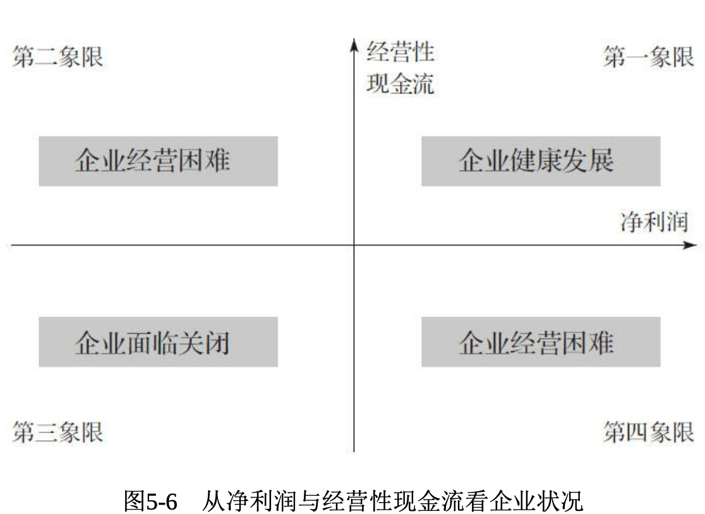

作为企业的管理者，应该如何增加企业的经营性现金流量呢?只有 两个着手点。

**第一，从产品入手，通过提升企业盈利能力增加企业自身产生的资金。**

**第二，从效率入手，通过存货管理、信用政策管理和供应商管理， 提高流动资金的管理效率。**

作为投资者，除了关心经营性现金流量外，还应当关心另外两个重 要的指标:**每股现金净流量**和**支付给职工以及为职工支付的现金**。

对于投资者来说，现金流量的窗口是每股现金净流量，需要重点分 析的是每股现金净流量和每股收益之间的关系。如果每股收益中可能有很多的注水，那么每股现金净流量就是挤干水分的一个最为关键和重要的指标。

投资者还应当关注支付给职工及为职工支付的现金这一重要指标。这是一个非常简单且常用的指标，一家公司如果都不打算为员工支付薪酬，不给员工缴五险一金，或者在现金流量 表中，这个数字摇摆不定或者连年递减，那么这家公司将衰退无疑。

不少企业的利润表连年快速增长，但现金却持续流出，这样的企业资金链存在很大的断裂风险。在这个现金为王的时代，分析一家公司的财务报表，一定不能忽略现金流量表的重要性。

## 第6章 发展能力

无论是投资者还是企业的经理人，最重视的是企业的盈利，而企业 记录盈利情况的报表叫作利润表。股神巴菲特就特别关注企业的盈利。 巴菲特曾经说过:“买股票就是买公司，只要公司的盈利长期增长，股价自然就会长期增长。”

股神巴菲特说，他看利润表的时候，看的不是最 后一行的利润是多少，也不是中间的某一行，他第一个关注的指标是**第一行的企业的销售收入**。

企业的销售收入是指企业销售商品的收入、提供劳务的收入和让渡 资产使用权的收入，它是企业在日常活动中形成的经济利益总收入。

销售收入是企业所有利润的最根本的来源。

必须特别关注利润的最根本来源——销售收入。**就像世界500强企业的排名，依据的不是资产规模，不是品牌价值，不是利润情况，而是销售收入。**

我们应该关注和分析销售收入的哪些关键指标呢?我认为，**企业最需要重视的指标是销售收入增长率**。

在各种反映企业发展能力的财务指标中，销售收入增长率指标是最 关键的指标。

**股利折现模型**的基本原理是一家公司的价值等于它未来收到的股利进行折现后的净现值。通俗地讲，就是任何资产的价值等于其预期未来 全部现金流折算到当前的价值总和。

要想用股利折现模型计算企业价值，一般需要把握三个变量:**企业存续的期限**、**企业在存续期限内每一期的股利**、**折现率**。一般而言，预期股利越高，企业的价值也就越高。

股利折现法适用于分红多且稳定的公司，尤其是非周期性行业的企 业;它不适用于分红很少或者不稳定的公司，尤其是周期性行业。

股利折现模型的公式如下，它表示公司的股价等于每期分红折成当 前价值的加总。

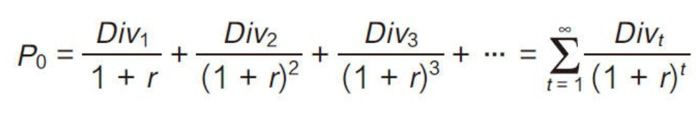

式中，Div1，Div2，Div3，...，Divt是指第1期、第2期、第3期...... 第t期的股利(也称股息、红利、分红);P0是指股票当前的价格;r是 指预期投资回报率(贴现率)。

通过对股利折现模型的分析，不难看出股票的价格只与两个因素有 关:一个是预期投资回报率(r)，另一个是股利(Div)。如果投资者 对未来每年的预期投资回报率假设不变，股票的价格就完全取决于未来的股利。在真实市场环境下，投资者对长期投资回报率的预期往往保持 着稳定状态。因此如果股票价格要保持持续不断的增长，那么股利必须 保持持续稳定的增长，所以**股利不增长，股票价格就一定不会增长。**

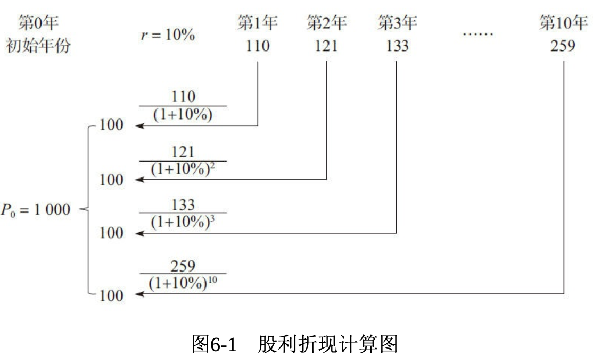

**股价、股利(分 红)、利润和销售收入的逻辑关系是，只有销售收入持续稳定增长，利润才会持续增长，利润持续增长才会导致股利持续增加，股利增加才会推动股票价格增长。**这也就是为什么所有机构投资者、投资银行在判断企业是否值得投资时，第一个关注的因素就是销售收入的增长情况和未来增长的空间。

什么是高质量或者高含金量的销售收入增长呢？**销售收入在持续不断增长的同时，利润也在持续稳定地增长，而且利润的增长率要比收入的增长率更高。**

我们不能只 看财务报表账面上的销售收入增长率的高低，还一定要分析财务报表数据，找到驱动销售收入增长的最根本因素。

- 价格第一

一家企业最基本的销售收入的财务模式就是: 销售收入=销售价格×销售量。

评估一家企业的好坏，最重要的单一性、决定性因素，就是企业的 定价能力。

只有那些具有“**经济特权**”的企业，才能不断地提高价格并且保持 销量不会下滑。这里所谓的“经济特权”是指商品的三个特点：

**第一，顾客需要或者顾客希望得到的，也就是顾客“想要的”。**

**第二，顾客认为找不到很类似的替代品，除了你之外，别的我都不要，也就是顾客“只要的”。**

**第三，因为顾客“想要”又“只要”它，就相当于这个商品把一个狭窄的市场给垄断了，既然垄断了市场，政府也会限制价格，但这种商品的价格不受政府管制，总结起来就是“不受管制的”。**

- 提升销售量

如果销售价格无法提升，那么企业可以做的就是提升销 售量，“中国制造”在世界范围内的成功就印证了这一逻辑。

- 地域扩张
- 全球化
- 新产品驱动

对于这五大驱动因素，我们思考、分析和研判的优先顺序是从定 价、销售量、扩张、全球化到产品创新。

此外，在分析销售收入的驱动因素的过程中，我们还需要结合自身产品的生命周期进行分析。

根据产品生命周期理论，我们可以简单了解到，一个产品从出生、成长到消亡，一般可以划分为四个阶段:导入期、成长期、成熟期和衰退期。

如果企业营业收入的增长率超过20%甚至更高，则说明企业产品处 于快速发展期。

如果营业收入增长率低于20%，则说明企业产品已进入稳定期，不 久将进入衰退期，需要为开发新产品做好准备。

如果营业收入增长率低于5%，甚至出现负增长，那么说明企业产 品已进入衰退期，保持市场份额已经很困难，营业利润开始滑坡，如果 没有已开发好的新产品，企业将步入衰落。在这一阶段，千万不可以坐 以待毙，企业有以下两个积极的选择：

**第一，选择恰当的时机将企业出售。**

**第二，转型。**

## 第7章 控制能力

企业的控制能力表现在两个方面:**一是与产品相关的成本控制能 力，二是与企业执行力相关的预算控制能力(计划的执行力)。**

**成本**是指企业取得资产或劳务的支出，应当与销售商品或提供劳务 而取得的收入进行配比。

方向、目标正确是第一步，也就是所 谓的“做正确的事情”。

第二步就是要确定从哪条路线到达目的地，计划或规划的 时间跨度可以是几个月、一年甚至是几年，这都是围绕战略目标所确定 的。

第三步，如果我们把计划细化到年，并且量化，那就是预算。预算就是把行动计划进行量化，用数字反映，是可以衡量的计划。

企业的预算体系包括搭建**目标体系**、**任务体系**和**考核体系**。

## 第8章 营运能力

“企业管理”是指通过计划、组 织、领导、控制及创新等手段，结合人力、物力、财力、信息等资源， 以期高效地达到“企业目标”的过程。由此可见，“企业管理”就是管 理“人”“财”“物”和“信息”等资源，而提高管理效率就是提 升“人”“财”“物”和“信息”的运用效率。

**周转率和效率**

提升一家企业的效率，就是提升企业员工的效率和企业资产负债表上“资产”的运作效率。

资产周转率越高，就说明企业资产的营运效率越高。

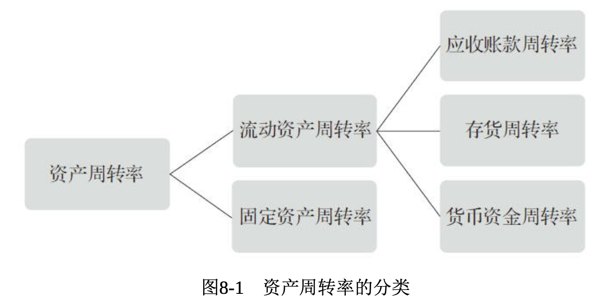

**应收账款周转率和周转天数**

应收账款周转率就是在一定期间内公司的应收账款转化为现金的平 均次数，其计算公式为:

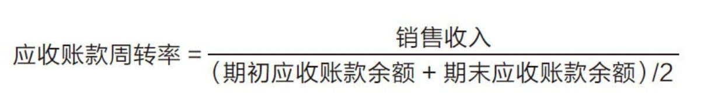

通俗地说，就是每1元应收账款的投资可以支持多少销售收入。

这个简单的公式背后的道理并不简单，它告诉我们两个朴素的企业 经营原则:**一家好的企业，销售收入一定是越高越好，同时，应收账款余额越少越好**。

应收账款的周转天数就等于一年(用360天代表一年是为了统一和 方便数字计算)除以应收账款的周转率。

世界500强企业通常 会用DSO(应收账款周转天数)表格来管理企业的应收账款。DSO表格 样式如表8-1所示。

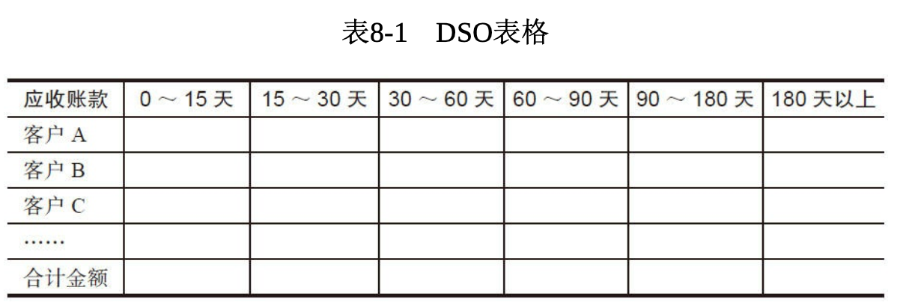

DSO表格在世 界500强企业，尤其在快消品、医药医疗等行业被广泛使用。通过对 DSO表格进行分析，企业可以简单、清晰地了解各个经销商和客户的管 理情况。

应收账款的管理措施:

- 重视信用调查
- 重视信用调查
- 合理的收账策略
- 应收账款的跟踪评价
- 加强销售人员的回款管理
- 定期对账，加强应收账款的催收力度
- 控制应收账款发生，降低企业资金风险
- 控制应收账款发生，降低企业资金风险
- 建立健全公司机构内部的监控制度

**存货周转率和周转天数**

应收账款管理能力的高低是指企业销售环节完成后，回收欠款能力 的高低。对企业来说，比收款更重要的环节是，产品能否卖掉。这个环 节根据哪个指标来衡量呢?存货周转率。

**存货周转率是企业在一定时期销售成本与平均存货余额的比率，它反映了存货的周转速度。**

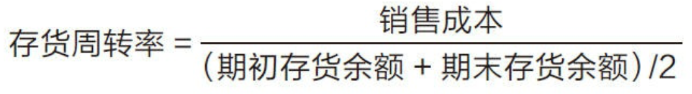

请注意，这个公式中的分子与应收账款周转率计算公式中的分子是 不同的，这里的分子是**销售成本**。为什么用销售成本而不是销售收入呢?我先分别解释这个公式中各项的含义。

**周转率代表企业的运营效率，越高越好**。要想提高应收账款的周转率，分子(销售收入)越大越好，同时分母(平均应收账款)则越小越 好。这不仅考验了企业的发展能力，还考验了企业管理应收账款余额的 能力。**要提高存货周转率，就要求企业在降低成本的同时，将存货的平均余额控制得更低。**

同样地，存货的周转天数是用360天除以存货周转率得到的。

**现金周期**

流动资产的三大组成部分包括应收账款、存货和货币资金。

对于货币资金，我们会用一种全新的方法进行管理——现金周期。

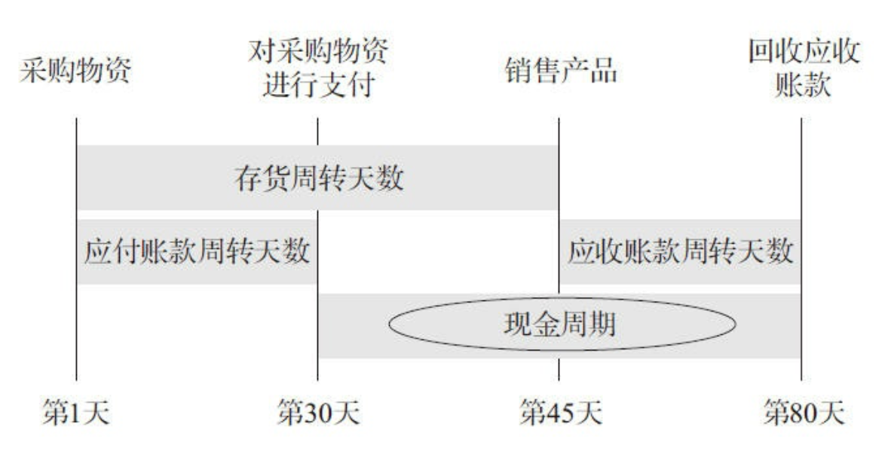

现金周期是指在生产销售活动中，从对采购物资进行支付到销售回款的时间间隔。如果从企业管控的角度来说，企业的现金周期当然是越 短越好。现金周期的计算公式如下:**现金周期=存货周转天数+应收账款周转天数-应付账款周转天数**

从企业管理者的角度看，我们应 当尽可能地缩短存货周转天数和应收账款周转天数，同时尽可能地延长 应付账款的周转天数，以此来缩短现金周期，即快销售、快收款、慢付款。

管理企业的货币资金并非管理资金本身，而是管理好企业的应收账款、存货和应付账款。

现金周期的缩短，就意味着企业货币资金使用效率的提高，同时意 味着企业可以使用更小的平均货币资金余额进行企业经营。

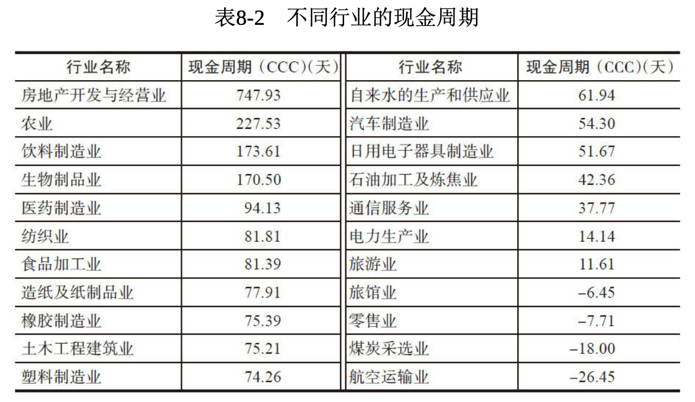

**货币资金短缺与盈余**

企业可以通过哪些手段来盘活内部的资金呢?

首先，加强应收账款的管理。

其次，调整企业资金结构。

再次，提高资金使用效率，降低经营管理成本。

最后，加强存货管理。

企业提升流动资产管理效率的方法，简而言之，就是“缩短”各种流 动资产的周期。而企业提升固定资产营运效率的方法与提升流动资产管 理效率的方法恰恰相反，是“延长”固定资产的使用周期。

固定资产周转率的计算公式如下:

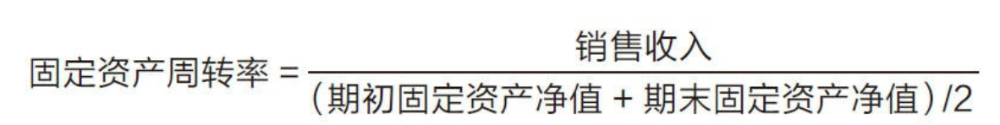

固定资产周转率是指在一个会计年度内固定资产周转的次数，表示 每1元固定资产支持的销售收入，这个数字和其他的周转率一样，越大 越好。固定资产周转率的计算公式包括两层含义。

第一，如果条件允许，企业对固定资产的投入越少越好，甚至可以不投入任何固定资产。

第二，通过延长固定资产使用周期，尽可能降低固定资产的净值，从而提高固定资产的营运效率。

**总资产运营效率**

前面我们已经分析了提升流动资产(应收账款、存货和货币资金) 以及固定资产的营运效率的方法，这里我们将对企业资产营运效率做一 个总结。以下是企业总资产营运效率的计算公式。

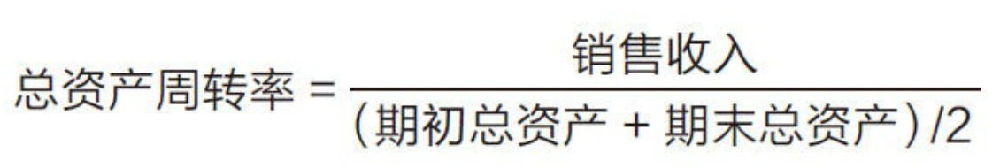

总资产周转率是综合评价企业全部资产的经营质量和利用效率的重 要指标。总资产周转率越大，说明总资产周转得越快，销售能力和营运 能力越强。

## 第9章 盈利能力

### 毛利率:企业利润的“起点”

我们通常用毛利率、净利润率以及净资产收益率来衡 量企业的盈利能力。

毛利是产品销售收入与产品成本之差;毛利率就是毛利占产品销售 收入的比例。毛利率代表了产品的盈利能力和市场竞争力。毛利率的计 算公式如下:

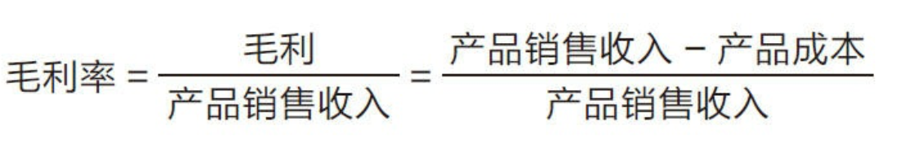

毛利率是评价企业盈利能力的关键经营指标之一，毛利率之所以重 要，是因为它反映了企业产品销售的初始获利能力，是企业利润的“起 点”，没有足够高的毛利率，企业便不可能形成较大的盈利。

### 净利润率:企业实际的盈利能力

净利润率是反映企业盈利能力的另外一项重要的财务指标，是扣除
所有成本、费用和企业所得税后的利润率。

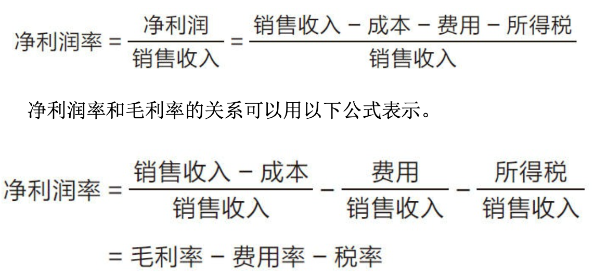

我们分析净利润率时，不应该简单地分析净利润率这个数值本身，而应当**着重分析净利润率的两个重要的组成部分:毛利率和费用率**。通过分析毛利率和费用率，找出提升净利润率的方法和途径。

### 净资产收益率:ROE

净资产收益率，是税后净利润除以净资产(股东权益)得到的百分 比。它代表了股东投入的每1元钱可以得到的投资回报，反映了股东权 益的收益水平，用以衡量企业运用自有资本的效率。

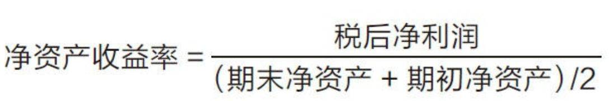

净资产收益率是反映企业价值的综合性很强的重要指标。因此，在分析净资产收益率时，我们会把它拆解成以下几部分:

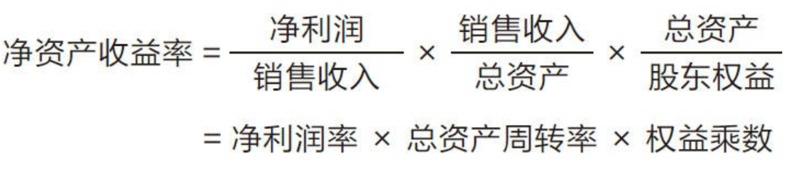

当把净资产收益率拆解以后，我们会发现影响净资产收益率的有三 项重要指标:**净利润率、总资产周转率和权益乘数**。净利润率代表产品 的盈利情况;总资产周转率代表企业的营运效率;权益乘数则代表企业 的资金杠杆的运用能力。

所以管理净资产收益率的真实含义就是管理好企业的价值，也就是管理好企业的产品、效率和财力。

杜邦分析法(DuPont Analysis)是一种比较通用和经典的用来分析 净资产收益率的方法。

杜邦模型：

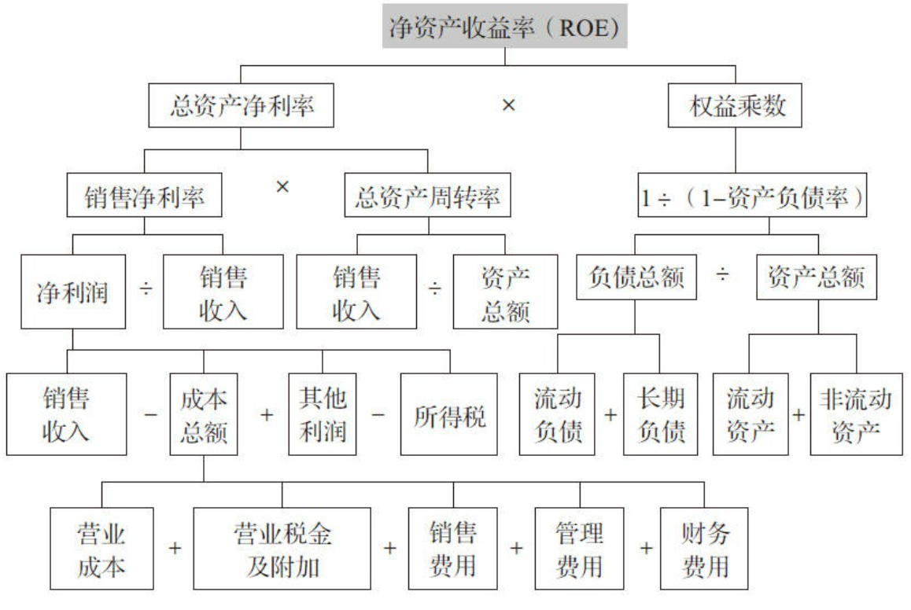

## 第10章 偿债能力

偿债能力是指企业偿还到期债务(包含本金及利息)的能力。

### 企业长期偿债能力:资产负债率

企业偿债能力包括短期偿债能力和长期偿债能力两个方面。我们通 常用资产负债率代表企业的长期偿债能力，流动比率和速动比率代表企 业的短期偿债能力。

资产负债率是负债总额除以资产总额的百分比，也就是负债总额与 资产总额的比例关系。

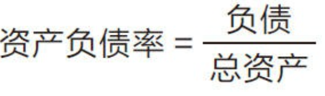

资产负债率决定了之前我们讲解的盈利能力的重要构成指标之一 ——权益乘数。资产负债率越高，权益乘数越高。

### 企业短期偿债能力:流动比率、速动比率

企业资产的安全性应包括两个方面的内容:一是有相对稳定的现金 流和流动资产比率;二是短期流动性比较强，不至于影响盈利的稳定 性。因此，在分析企业资产的安全性时，应该从以下两个方面入手。

首先，企业资产的流动性越大，企业资产的安全性就越大。

其次，在流动性资产额与短期需要偿还的债务额之间，要有一个最 低的比率。如果达不到这个比率，那么就应当或者增加流动资产额，或 者减少短期内需要偿还的债务额。我们将这个监控资产流动性的比率称为流动比率。流动比率是评价企业短期偿债能力较为常用的比率。

流动比率是流动资产对流动负债的比率，用来 衡量企业流动资产在短期债务到期以前，可以变为现金用于偿还负债的 能力，它表明企业每1元流动负债有多少流动资产作为支付的保障。

计算公式:

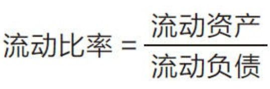

在流动资产之中，虽然现金、有价证券、应收账款变现能力很强，但是存 货、预付账款等也属于流动资产的项目且变现时间较长，特别是存货很 可能发生积压、滞销、残次等情况，流动性较差。因此，我们把流动资 产根据资产形态分为两类:一类是存货，比如原材料、半成品等实物资 产;另一类是速动资产。

速动资产是指可以迅速转换成为现金或已属于现金形式的资产

速动资产是指从流动资产中扣除变现速度最慢的存货等资产后，可 以直接用于偿还流动负债的那部分流动资产。但也有观点认为，应以 **(流动资产-存货-预付账款)/流动负债**表示。这种观点比较稳妥。

偿债能力好比是众多关键财务指标中的那个拥有一票否决权的 指标，控制得好固然会对企业有所帮助，但如果偿债能力指标失控，对于企业来说就是致命的。

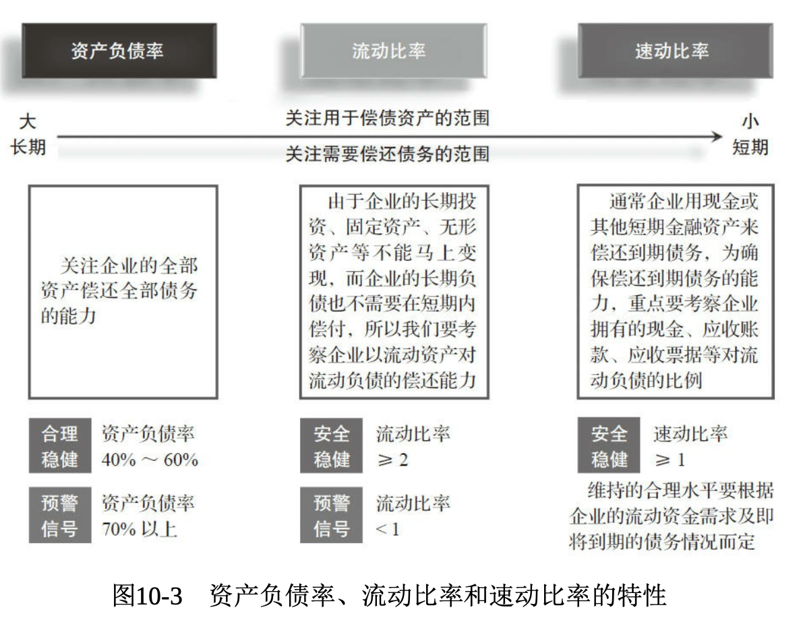

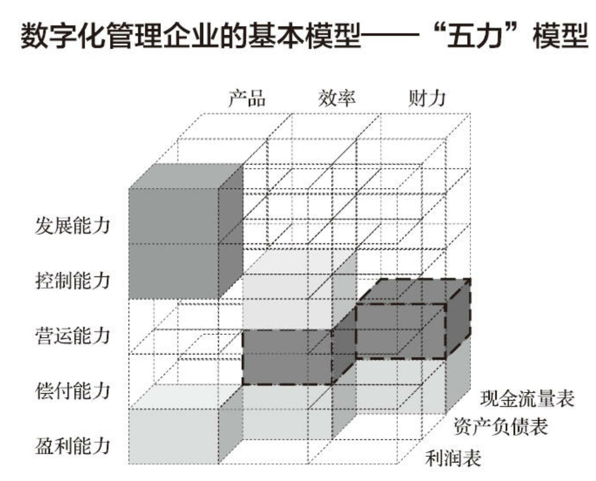

